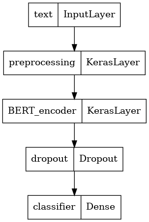

```{r setup, include=FALSE, message=FALSE}
knitr::opts_chunk$set(fig.pos = 'H', echo = FALSE, warning = FALSE, message = FALSE, comment = NA)
library(rmarkdown)
library(knitr)
library(tidyverse)
library(dplyr)
# base_family = 'STXihei'
```

\tableofcontents

\newpage

# 摘要

我们使用 IMDB 数据集进行文本分类。我们使用主题模型进行文本挖掘，之后进行情感分类。在文本预处理阶段，我们尝试使用词编码和词向量的方式，在训练阶段，我们构建了 DNN、LSTM、BERT 等多个深度学习模型进行训练，并进行了模型比较，最终达到了 90% 的准确率。最后，为了进一步实现在超大文本集上进行训练，我们使用基于 Spark 的分布式算法在集群服务器上进行训练测试。

| 模型         | 计算配置    | 用时   | 准确率 | 可拓展性 |
| ------------ | ----------- | ------ | ------ | -------- |
| tokenize + DNN   |阿里云服务器 Xeon 8 核 CPU 32G 内存| 10 分钟 | 60% | 低-单机 |
| Word2Vec + LSTM  |阿里云服务器 Xeon 8 核 CPU 32G 内存| 2  小时 | 80% | 低-单机 |
| bert - 小型      |阿里云服务器 Xeon 8 核 CPU 32G 内存| 1  小时 | 90% | 低-单机 |
| bert - AL        |阿里云服务器 Xeon 8 核 CPU 32G 内存| 1.5小时 | 90% | 低-单机 |
| bert - 标准      |阿里云服务器 Xeon 8 核 CPU 32G 内存| 3  小时 | 92% | 低-单机 |
| spark            |中央财经大学大数据高性能分布式集群 | -- 分钟 | --% | 高-集群 |

> 分布式模型在该小型数据集上没有优势，进行此项的意义在于对大型文本数据集可拓展性的技术储备，仅有在文本量级超过单机可承载上限时，分布式计算才具备意义

# 数据集介绍

我们选择了 IMDB 的电影评论文本数据进行大数据建模研究。

IMDB 是一个隶属于亚马逊公司旗下的世界著名互联网电影资料库（Internet Movie Database）。它有着关于电影演员、电影、电视节目、电视明星和电影制作的在线数据，包括了影片的众多信息、演员、片长、内容介绍、分级、评论等，在电影评论评分时被广泛使用。IMDB 的论坛也十分活跃，除每个数据库条目都有留言板之外，还有关于多种多样的主题的各种综合讨论版。

我们将 IMDB 的电影评论文本用于自然语言处理的二元情感分类。我们使用 5 万条标有积极和消极标签的真实用户电影评论文本构建情感分类模型。 即使用深度学习算法预测评论为正面或是负面。

我们使用的文本为多语言文本，其中英文文本数量占绝大多数比例。

## 文本预处理

# 主题挖掘

# 深度学习

## 数据处理

1. 标签处理：分类标签由类别名称转为数字。
1. 数据集划分：在总体 5 万条文本中随机划分 20% 的测试集，再从训练集中划分 20% 的验证集。
    * 使用训练集的文本进行模型训练
    * 使用验证集的文本进行模型超参数的调整
    * 使用测试集的文本进行模型效果评价
1. 数据集格式转换：使用自动的缓冲区大小，使用 32 的 `batch size`。
    * batch size 为一次训练所抓取的数据样本数量
    * 分批训练相对于直接对全训练集训练的好处在于：提高了每次迭代的训练速度、利于多线程训练、使得梯度下降的方向更加准确
    * batch size 的大小与模型的收敛速度和随机梯度噪音有关
    * 当 batch size 过小时，在一定的迭代次数下，模型来不及收敛
    * 当 batch size 过大时，一方面容易出现内存紧缺，另一方面模型的泛化能力会变差

## Tokenize + DNN

### 文本预处理

### DNN 模型结构

我们搭建了一个三层神经网络用于训练。


### 模型训练

正常情况下，随着训练迭代次数的增加，损失函数逐渐减小，对训练集的拟合越来越趋向于精细。然而过度精细的拟合容易导致模型的泛化能力变差，即当模型用于之前未曾训练过的数据时表现很差。为了观测这种情况，我们需要划分一部分数据与用于训练的数据隔开，这便是我们划分验证集的原因之一。

为了防止模型过拟合，我们设定在验证集准确率连续三次迭代不再上升时提前终止训练。

## Word2Vec + LSTM

### Word2Vec

在词编码的基础上，我们对文本进行 word2vec 处理

---

word2vec 介绍

---

### LSTM 模型结构

1. 第一层为 `Embedding` 层，我们使用 `word2vec` 方法将单词编码转换为词向量。这些词向量经过训练，对于意思相近的词，其向量夹角小。
2. 第二层使用双向的长短期记忆层。长短期记忆网络层是一种特殊的循环神经网络层，它能够减轻长序列训练过程中的梯度消失和梯度爆炸问题，适合此处词向量长度较长的情况。它遍历序列中的每个元素作为输入，按照时间顺序传递输出。由于我们使用双向结构，最终结果由输入的前向和后向传递共同决定，这使得最前端的输入不必通过漫长的处理步数才能影响到最终结果，有效的提高了训练在文本中的均匀度。
3. 第三层为全连接层，由于在多层神经网络中梯度容易在深层网络中变得极小，使得参数无法正常更新，所以我们使用 `RELU` 作为激活函数解决梯度消失问题。
4. 第四层为输出维度为 5 的输出层，为了得到多分类的概率值，使用 `softmax` 函数将输出值压缩至 0 - 1 的范围内。

### 模型训练


## BERT

### BERT 介绍

BERT 是一系列双向文字编码转换模型的总称，用来结合上下文语义计算每个词的词向量，在自然语言处理中被广泛使用。

我们使用了前人在超大型语料库上训练的已有基础 BERT 模型，通过迁移学习的方式在我们的 BBC 文本数据集上进行微调。

### 加载预训练 BERT 模型

我们首先使用了一个参数量较少的 small-BERT 模型用于测试，在通过测试后，为了进一步提升模型的准确度，我们使用 al-BERT 进行正式训练。

### 预处理模型

在 BERT 的输入层，对于原始的文字输入，我们需要将其转换成为数值编码。每一个 BERT 模型都有其严格对应的预处理模型来提升转换效果。

对于 small-BERT 模型预处理模型将输入的向量设为 128 的长度。

### BERT 模型结构

```{r, out.width='50%', fig.align='center'}

```

### 模型训练

```{r, out.width='50%', fig.align='center'}
knitr::include_graphics("../figure/bert_train.png")
```

---

分析趋势

---

#### 损失函数

我们使用交叉熵作为我们的损失函数：

$$ -\sum_{c=1}^My_{o,c}\log(p_{o,c}) $$

其中：

- M 是分类数
- y 是标签 c 在观测 o 下是否分类正确的 0/1 变量
- p 是预测概率

#### 学习率

由于神经网络刚开始训练时非常不稳定，因此刚开始的学习率应当设置得很低很低，这样可以保证网络能够具有良好的收敛性。但是较低的学习率会使得训练过程变得非常缓慢，因此这里采用从较低学习率逐渐增大至较高学习率的方式实现网络训练前 10% 次迭代的“热身”阶段。一直使用较高学习率是不合适的，因为它会使得权重的梯度一直来回震荡，很难使训练的损失值达到全局最低谷。因此在 warm-up 结束后，我们使用线性减小的学习率。

#### 优化器

在迁移学习时，我们选取的优化器与 BERT 在预训练时的 `Adamw` 优化器保持一致。

```{r, out.width='50%', fig.align='center'}

```

Adam 的超收敛性质使其在训练学习率高的神经网络时可以达到节省迭代次数的效果。只要调整得当，Adam 在实践上都能达到 SGD+Momentum 的高准确率，而且速度更快。在几年前人们普遍认为 Adam 的泛化性能不如 SGD+Momentum，然而今年论文表明这通常是由于所选择的超参数不正确导致，通常来说 Adam 需要的正则化比 SGD 更多。

### 模型应用

# 分布式训练

我们使用 `pyspark` 进行分布式训练。

---

对分布式的解释

---

## 环境启动

* 通过 YARN 资源调度系统提交到作业队列： `spark-submit --master yarn`
* 由于在 UDF（用户自定义）函数中使用了第三方包，需要将其发送至集群中的每个计算节点 `--py-files gensim.zip`
* 队列计算完成后将结果重定向输出 `> output.txt`

## 数据读取

由于数据为逗号分隔的 csv 格式，在文本列出现混淆。我们使用 pandas 进行读取后再转换为 spark DataFrame 格式

+--------------------+---------+
|              review|sentiment|
+--------------------+---------+
|One of the other ...| positive|
|A wonderful littl...| positive|
|I thought this wa...| positive|
|Basically there's...| negative|
|Petter Mattei's "...| positive|
|Probably my all-t...| positive|
|I sure would like...| positive|
|This show was an ...| negative|
|Encouraged by the...| negative|
|If you like origi...| positive|
|Phil the Alien is...| negative|
|I saw this movie ...| negative|
|So im not a big f...| negative|
|The cast played S...| negative|
|This a fantastic ...| positive|
|Kind of drawn in ...| negative|
|Some films just s...| positive|
|This movie made i...| negative|
|I remember this f...| positive|
|An awful film! It...| negative|
+--------------------+---------+

